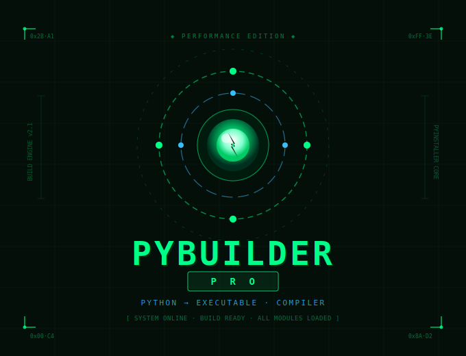

<p align="center">
  
</p>

<div align="center">

<!-- Animated Banner SVG -->


<!-- Glowing Title -->
<br/>

```
██████╗ ██╗   ██╗██████╗ ██╗   ██╗██╗██╗     ██████╗ ███████╗██████╗     ██████╗ ██████╗  ██████╗
██╔══██╗╚██╗ ██╔╝██╔══██╗██║   ██║██║██║     ██╔══██╗██╔════╝██╔══██╗    ██╔══██╗██╔══██╗██╔═══██╗
██████╔╝ ╚████╔╝ ██████╔╝██║   ██║██║██║     ██║  ██║█████╗  ██████╔╝    ██████╔╝██████╔╝██║   ██║
██╔═══╝   ╚██╔╝  ██╔══██╗██║   ██║██║██║     ██║  ██║██╔══╝  ██╔══██╗    ██╔═══╝ ██╔══██╗██║   ██║
██║        ██║   ██████╔╝╚██████╔╝██║███████╗██████╔╝███████╗██║  ██║    ██║     ██║  ██║╚██████╔╝
╚═╝        ╚═╝   ╚═════╝  ╚═════╝ ╚═╝╚══════╝╚═════╝ ╚══════╝╚═╝  ╚═╝    ╚═╝     ╚═╝  ╚═╝ ╚═════╝
                                     CREATED -  BY ATHEX BLACK HAT 
```

<br/>


<br/><br/>


<br/>


<br/><br/>

[`⚡ Features`](#-features) &nbsp;•&nbsp; [`📥 Install`](#-installation) &nbsp;•&nbsp; [`🚀 Quick Start`](#-quick-start) &nbsp;•&nbsp; [`⚙️ Performance`](#-performance-optimization-guide) &nbsp;•&nbsp; [`🔧 Troubleshoot`](#-troubleshooting) &nbsp;•&nbsp; [`❓ FAQ`](#-faq)

</div>

---

<br/>

## 🎯 What Is PyBuilder Pro?

<table>
<tr>
<td width="60%">

**PyBuilder Pro** is a production-grade graphical interface for compiling Python scripts into standalone `.exe` executables — powered by **PyInstaller** with intelligent optimization layers on top.

No CLI knowledge needed. No manual flags. Just select your script, tune your settings, and hit build.

</td>
<td width="40%" align="center">

```
  .py ──────────────────► .exe
        ┌──────────────┐
        │  PyBuilder   │
        │     Pro      │
        │  ┌────────┐  │
        │  │ Smart  │  │
        │  │ Optim  │  │
        │  └────────┘  │
        └──────────────┘
     Auto deps • Fast build
     Smart strip • 50% smaller
```

</td>
</tr>
</table>

> **⚡ Performance Edge:** Up to **50% smaller** executables with **faster startup** via smart module exclusion, AST-based import analysis, and PyInstaller v6.0+ compatibility — all from a clean dark-theme GUI.

<br/>

---

## ✨ Features

<div align="center">

### Core Capabilities

</div>

<table>
<tr>
<td align="center" width="25%">

```
    🎨
  ┌─────┐
  │ GUI │
  └─────┘
```
**Modern Dark UI**
Tabbed interface with real-time build logs

</td>
<td align="center" width="25%">

```
    ⚡
  ┌─────┐
  │ OPT │
  └─────┘
```
**Performance Edition**
Strip symbols, exclude unused modules

</td>
<td align="center" width="25%">

```
    🤖
  ┌─────┐
  │ AST │
  └─────┘
```
**Auto Import Detection**
AST-based script dependency analysis

</td>
<td align="center" width="25%">

```
    📊
  ┌─────┐
  │ LOG │
  └─────┘
```
**Live Build Logs**
PyInstaller output streamed in real-time

</td>
</tr>
</table>

<br/>

### 🔍 Full Feature Matrix

| Feature | Status | Details |
|---------|:------:|---------|
| 🎨 Dark Theme GUI | ✅ | Tabbed layout, intuitive workflow |
| ⚡ Perf Optimization | ✅ | Faster startup, smaller size |
| 📦 One-Click Build | ✅ | Progress bar + live logging |
| 🖼️ Custom Icon Support | ✅ | `.ico` files for Windows |
| 🗜️ UPX Compression | ✅ | Optional 30–50% size reduction |
| 🧹 Auto Build Cleanup | ✅ | Removes temp artifacts post-build |
| 🤖 AST Import Analysis | ✅ | Detects all script dependencies |
| 🔧 PyInstaller v6.0+ | ✅ | Fully compatible, auto-detects version |
| 📈 Performance Report | ✅ | Build time + size metrics |
| 🛡️ UAC Admin Support | ✅ | Windows privilege elevation |

<br/>

---

## 📥 Installation

<div align="center">

```
Step 1          Step 2          Step 3          Step 4
  📂    ──►      📦    ──►      ✅    ──►      🚀
Clone Repo   Install Deps    Verify Deps    Launch App
```

</div>

<br/>

**1 · Clone the Repository**

```bash
git clone https://github.com/Athexblackhat/Py-Builder-Pro.git
cd Py-Builder-Pro
```

**2 · Install Dependencies**

```bash
pip install -r requirements.txt

# Or manually:
pip install PyQt5 pyinstaller
```

**3 · Launch**

```bash
python install.py
```

> 💡 **Optional — UPX Compression:** Download from [upx.github.io](https://upx.github.io/), place `upx.exe` in your `PATH` or script directory, then enable it in the **Performance** tab for 30–50% smaller executables.

<br/>

---

## 🚀 Quick Start

<div align="center">

```
①              ②              ③              ④              ⑤
Launch    ──► Select    ──► Configure ──► Tune Perf  ──► Build!
App            Script         Options       Settings
```

</div>

<br/>

```bash
# Launch the app
python run.py
```

Then, inside the GUI:

| Step | Action |
|------|--------|
| **①** | Click **Browse** → select your `.py` file |
| **②** | Set output folder (default: Desktop) |
| **③** | ☑ **Single File Executable** &nbsp;&nbsp; ☐ **Show Console** (for GUI apps) |
| **④** | ☑ **Strip Debug Symbols** &nbsp;&nbsp; ☑ **Auto-detect imports** |
| **⑤** | Hit `⚡ BUILD OPTIMIZED EXECUTABLE` and watch the logs |

<br/>

---

## ⚡ Performance Optimization Guide

<div align="center">

### Trade-off Matrix

| Mode | Startup Speed | File Size | Best For |
|:----:|:-------------:|:---------:|----------|
| `onefile` + UPX | 🟡 Slow | 🟢 Smallest | Distribution / Downloads |
| `onefile` + No UPX | 🟡 Medium | 🟢 Small | Balanced daily use |
| `onedir` + No UPX | 🟢 Fastest | 🟡 Larger | Dev / frequent launches |

</div>

<br/>

### 🎯 Recommended Presets

<table>
<tr>
<td width="33%">

#### 🚀 Max Speed
```
Mode:     onedir
UPX:      ❌ Disabled
Strip:    ✅ Enabled
Exclude:  tkinter, unittest,
          email, html, http,
          xml, curses, pdb
```

</td>
<td width="33%">

#### 📦 Smallest Size
```
Mode:     onefile
UPX:      ✅ Enabled
Strip:    ✅ Enabled
Exclude:  All unused modules
```

</td>
<td width="33%">

#### ⚖️ Best Balance ⭐
```
Mode:     onefile
UPX:      ❌ Disabled
Strip:    ✅ Enabled
Exclude:  tkinter, unittest,
          test, distutils
```

</td>
</tr>
</table>

<br/>

### 🔬 What Each Setting Does

<details>
<summary><b>🗜️ Strip Debug Symbols <code>--strip</code></b></summary>

- **Effect:** Removes debug metadata → smaller file
- **Startup impact:** None
- **Recommendation:** ✅ Always enable
</details>

<details>
<summary><b>📦 UPX Compression</b></summary>

- **Effect:** 30–50% smaller executable
- **Startup impact:** +20–30% (decompression overhead)
- **Recommendation:** Enable for distribution, disable for frequent launches
</details>

<details>
<summary><b>🚫 Module Exclusion</b></summary>

- **Effect:** Strips unused stdlib modules from bundle
- **Default exclusions:** `tkinter, unittest, test, distutils, email, html, http, xml, curses, pdb`
- **Recommendation:** Add anything your script doesn't use
</details>

<details>
<summary><b>🤖 Auto Import Detection</b></summary>

- **Effect:** AST-scans your script → auto-collects all detected imports
- **Build time impact:** Slightly longer build
- **Recommendation:** ✅ Enable for complex projects
</details>

<br/>

---

## 📖 Configuration Reference

### Complete Options Table

| Option | PyInstaller Flag | Default | Description |
|--------|:----------------:|:-------:|-------------|
| Single File | `--onefile` | ✅ On | Bundle into one `.exe` |
| Console | `--console` | ❌ Off | Show terminal window |
| Custom Name | `--name` | Script name | Output filename |
| Icon | `--icon` | — | `.ico` app icon |
| Strip | `--strip` | ✅ On | Remove debug symbols |
| UPX | `--upx-dir` | ❌ Off | Compress executable |
| Hidden Imports | `--hidden-import` | — | Dynamic import declarations |
| Data Files | `--add-data` | — | Bundled assets |
| Exclude Modules | `--exclude-module` | — | Strip unused libs |
| Optimization | `--optimize=2` | Always | Python bytecode opt |
| UAC Admin | `--uac-admin` | ❌ Off | Admin rights (Windows) |

<br/>

### 📁 Data Files Format

```
# Single file → root
config.json;.

# Glob → subfolder
images/*.png;images/

# Multiple files
data.txt;.,config.ini;.,assets/*;assets/
```

### 🔌 Hidden Imports Examples

```
numpy._core, pandas._libs, PyQt5.sip, cryptography.hazmat
```

<br/>

---

## 🔧 PyInstaller v6.0+ Compatibility

PyBuilder Pro **v2.1.0** is fully tested against PyInstaller v6.0+, with automatic version detection:

```python
# Auto-adjusts flags based on your installed version
pyinstaller_version = PerformanceOptimizer.get_pyinstaller_version()
# Returns (6, 0) for PyInstaller v6.0.0
```

| Breaking Change | Solution Applied |
|----------------|-----------------|
| Changed CLI arguments | Updated command generation |
| Removed deprecated flags | Using v6.0+ compatible alternatives |
| New default behaviors | Explicitly set required flags |
| Environment changes | Optimized environment variables |

<br/>

---

## 📚 Examples

<details>
<summary><b>🖥️ Example 1 — PyQt5 GUI Application</b></summary>

```python
# my_qt_app.py
import sys
from PyQt5.QtWidgets import QApplication, QLabel, QMainWindow

class MainWindow(QMainWindow):
    def __init__(self):
        super().__init__()
        self.setWindowTitle("My App")
        self.setCentralWidget(QLabel("Hello World!"))

app = QApplication(sys.argv)
window = MainWindow()
window.show()
sys.exit(app.exec_())
```

**Recommended Build Settings:**

| Setting | Value |
|---------|-------|
| Single File | ✅ |
| Console | ❌ |
| Strip | ✅ |
| UPX | ❌ (speed priority) |
| Hidden Imports | `PyQt5.sip` |

</details>

<details>
<summary><b>📊 Example 2 — Data Analysis Tool</b></summary>

```python
# data_analyzer.py
import pandas as pd
import matplotlib.pyplot as plt

def analyze_data():
    df = pd.read_csv('data.csv')
    df.plot()
    plt.show()

if __name__ == '__main__':
    analyze_data()
```

**Recommended Build Settings:**

| Setting | Value |
|---------|-------|
| Auto Imports | ✅ |
| Hidden Imports | `pandas._libs, matplotlib.backends` |
| Data Files | `data.csv;.` |

</details>

<details>
<summary><b>⚡ Example 3 — CLI Tool (Maximum Speed)</b></summary>

```python
# cli_tool.py
import argparse

parser = argparse.ArgumentParser()
parser.add_argument('--name', required=True)
args = parser.parse_args()
print(f"Hello, {args.name}!")
```

**Recommended Build Settings:**

| Setting | Value |
|---------|-------|
| Mode | `onedir` (fastest startup) |
| Console | ✅ |
| Strip | ✅ |
| Exclude | `tkinter, unittest, test, distutils, email, html, http, xml, curses, pdb` |

</details>

<details>
<summary><b>🗂️ Resource Path Helper (Data Files in EXE)</b></summary>

```python
import sys, os

def resource_path(relative_path):
    """Get absolute path to resource — works for dev and PyInstaller."""
    try:
        base_path = sys._MEIPASS
    except Exception:
        base_path = os.path.abspath(".")
    return os.path.join(base_path, relative_path)

# Usage:
config_path = resource_path("config.json")
```

</details>

<br/>

---

## 🔧 Troubleshooting

<details>
<summary><b>❌ "PyInstaller not found"</b></summary>

```bash
pip install --upgrade pyinstaller
python -m pip install pyinstaller
```
</details>

<details>
<summary><b>❌ Executable crashes immediately</b></summary>

1. Enable **Console** mode to see error messages
2. Disable **Auto-detect imports** → manually add hidden imports
3. Test directly: `pyinstaller --onefile your_script.py`
</details>

<details>
<summary><b>❌ ModuleNotFoundError in built executable</b></summary>

1. Add module to **Hidden Imports** field
2. Confirm install: `pip install module_name`
3. Temporarily disable **Exclude Modules** to isolate the issue
</details>

<details>
<summary><b>❌ Executable is very large (>50 MB)</b></summary>

1. Enable **Strip Debug Symbols**
2. Enable **UPX compression**
3. Expand **Exclude Modules** list
4. Switch to `--onedir` mode
5. Use a **virtual environment** with only required packages
</details>

<details>
<summary><b>❌ Slow startup time</b></summary>

1. Switch to `--onedir` mode
2. Disable **UPX compression**
3. Exclude large unused modules
</details>

<details>
<summary><b>❌ Data files not found at runtime</b></summary>

Use the `resource_path()` helper in the Examples section above.
</details>

<br/>

---

## ❓ FAQ

<details>
<summary><b>Can I build for other operating systems?</b></summary>

No — PyInstaller compiles for the current OS only. For cross-platform builds, run PyBuilder Pro on each target OS separately.
</details>

<details>
<summary><b>Why is my .exe so large?</b></summary>

Python executables bundle the interpreter + all dependencies. Use virtual environments, strip debug symbols, exclude unused modules, and optionally enable UPX.
</details>

<details>
<summary><b>Does it work with C-extension libraries (numpy, pandas, OpenCV)?</b></summary>

Yes — but they may require hidden imports or extra configuration. Use **Auto Import Detection** and add any remaining missing modules manually.
</details>

<details>
<summary><b>Can I password-protect my executable?</b></summary>

Not natively — Python executables can be decompiled. For IP protection, consider **PyArmor** or **PyOxidizer** for obfuscation.
</details>

<details>
<summary><b>onedir vs onefile — which should I use?</b></summary>

`onefile` extracts everything to a temp folder on each launch. `onedir` loads directly from disk. **→ Use `onedir` if startup speed matters. Use `onefile` for easy distribution.**
</details>

<br/>

---

## 🤝 Contributing

<div align="center">

```
Found a bug?        Have an idea?       Improving docs?     Writing code?
      🐛                 💡                   📝                  🔨
  Open Issue       Open Discussion        PR Welcome          PR Welcome
```

</div>


- Follow **PEP 8** guidelines
- Use **type hints** where possible
- Add **docstrings** to all functions and classes

<br/>

---

## 🙏 Acknowledgments

| Project | Contribution |
|---------|-------------|
| [PyInstaller](https://pyinstaller.org/) | The compilation engine powering everything |
| [Qt / PyQt5](https://riverbankcomputing.com/software/pyqt/) | The GUI framework |
| [UPX Project](https://upx.github.io/) | Optional executable compression |
| Python Community | Continuous inspiration and support |

<br/>

---

<div align="center">

```
─────────────────────────────────────────────────────
  PyBuilder Pro v1.5.0  •  MIT License  •  2026
─────────────────────────────────────────────────────
```


<br/>

[](https://github.com/Athexblackhat/Py-Builder-Pro/issues)
[](https://github.com/Athexblackhat/Py-Builder-Pro/discussions)
[](https://github.com/Athexblackhat/Py-Builder-Pro)

</div>
